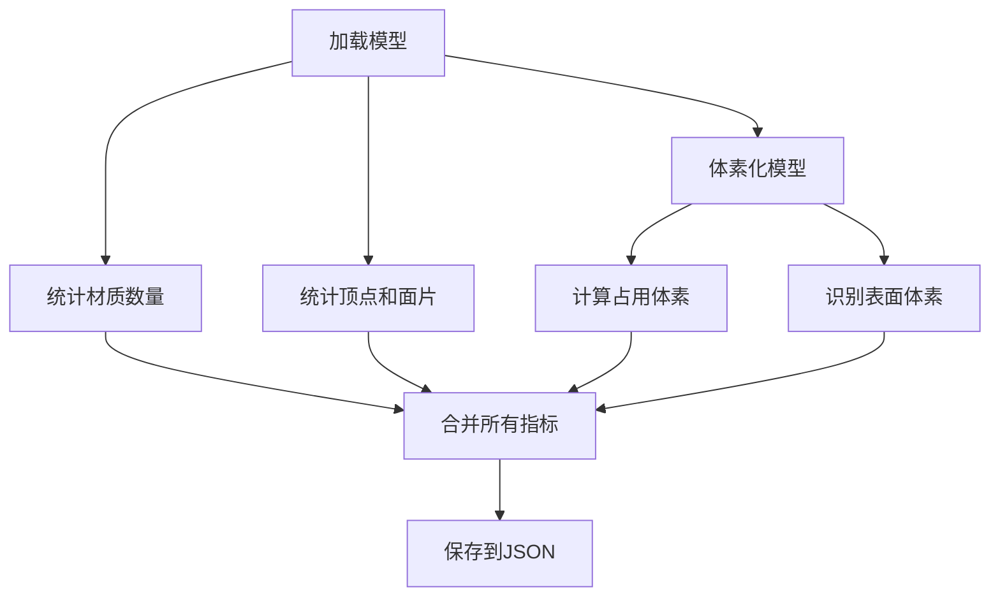

# 3D模型过滤系统使用指南

## 功能概述

这个模型过滤系统允许你基于材质个数和模型复杂度指标对已打标的3D模型进行过滤，将符合条件的模型复制到 `files/filtered_files` 目录。

## 核心指标

### 1. 材质个数
- 统计模型中的材质数量
- 可设置最小值和最大值范围

### 2. 复杂度指标

#### VVD (体素化顶点密度)
- **定义**: 原始顶点数 / 被占用体素数量
- **意义**: 衡量每个体素格子内平均包含的原始顶点数
- **典型值**: 植株等复杂模型的VVD通常远高于枕头等简单模型

#### VFC (体素化面片复杂度)
- **定义**: 原始面片数 / 被占用体素数量
- **意义**: 同等占用率下，面片密度更高的模型得分更高
- **用途**: 评估模型的几何细节丰富程度

#### VSC (体素表面复杂度)
- **定义**: 表面体素数量 / 被占用体素总数
- **意义**: 反映模型的"表面积/体积"比
- **典型值**: 植物等纤细复杂模型通常接近1.0，规则的大几何体接近0

### 体素分辨率
- 默认: 64 (即64×64×64网格)
- 范围: 16-128
- 影响: 分辨率越高，计算越精确但耗时越长

## 使用流程

### 第一步：计算指标

1. 在文件列表中切换到"已打标"视图
2. 点击"批量过滤"按钮
3. 在弹出的对话框中切换到"指标配置"选项卡
4. 配置参数：
   - 选择要计算的指标（VVD/VFC/VSC）
   - 设置体素分辨率（推荐64）
5. 点击"开始计算指标"
6. 系统会：
   - 遍历所有labeled_files中的文件
   - 跳过已有指标的文件（支持断点续传）
   - 计算选中的指标
   - 将结果保存到对应的JSON文件中

**注意**: 
- 如果指标已存在且分辨率匹配，会自动跳过，不会重复计算
- 计算过程不会阻塞其他操作
- 进度条显示实时进度和预计剩余时间

### 第二步：查看统计（可选）

1. 切换到"统计分析"选项卡
2. 点击"加载统计数据"
3. 查看：
   - 统计表格（最小值、最大值、均值、标准差等）
   - 密度分布图（可左右拖动查看）

这一步帮助你了解数据分布，为设置过滤阈值提供参考。

### 第三步：设置过滤条件

1. 返回"指标配置"选项卡
2. 设置材质个数范围（如2-5）
3. 为每个选中的指标设置阈值：
   - 最小值：低于此值的模型将被过滤掉
   - 最大值：高于此值的模型将被过滤掉

**示例配置**:
```
材质个数: 2 - 5
VVD: 1.0 - 10.0
VFC: 0.5 - 8.0
VSC: 0.2 - 0.9
```

### 第四步：执行过滤

1. 点击"开始过滤"按钮
2. 确认操作
3. 系统会：
   - 检查每个模型的指标是否在阈值范围内
   - 只有**所有指标都符合条件**的模型才会通过
   - 将通过的模型复制到 `files/filtered_files`
   - 保留原文件和JSON元数据

## 文件结构

### JSON元数据格式

每个模型文件都有一个对应的JSON文件，包含指标数据：

```json
{
  "name": "model.glb",
  "size": 1024000,
  "hasLabels": true,
  "labels": [...],
  "filterMetrics": {
    "materialCount": 3,
    "voxelResolution": 64,
    "vertexCount": 8192,
    "faceCount": 4096,
    "occupiedVoxels": 2048,
    "surfaceVoxels": 512,
    "VVD": 4.0,
    "VFC": 2.0,
    "VSC": 0.25,
    "computedAt": "2025-12-18T10:00:00Z"
  },
  "filteredAt": "2025-12-18T10:05:00Z"
}
```

### 目录说明

```
files/
├── raw_files/          # 原始未打标文件
├── labeled_files/      # 已打标文件（带语义标签）
└── filtered_files/     # 过滤后的文件（符合条件的模型）
```

## 性能优化

### 计算性能
- **并发控制**: 默认同时处理3个模型，避免内存溢出
- **断点续传**: 已计算过的指标不会重复计算
- **内存管理**: 每个模型处理完后立即释放资源

### 建议
- 对于大型数据集（>100个模型），建议分批计算
- 体素分辨率64已足够，除非需要极高精度
- 计算期间可以进行其他操作，不会阻塞UI

## 常见问题

### Q: 为什么有些文件显示"缺少指标数据"？
A: 该文件还没有计算过指标，需要先运行"开始计算指标"。

### Q: 如何重新计算某个文件的指标？
A: 
1. 删除对应JSON文件中的 `filterMetrics` 字段
2. 或者删除整个JSON文件
3. 重新运行"开始计算指标"

### Q: 过滤后的文件会删除原文件吗？
A: 不会。过滤是**复制**操作，原文件保留在 `labeled_files` 中。

### Q: 如何调整过滤条件？
A: 修改阈值后重新点击"开始过滤"即可，无需重新计算指标。

### Q: 体素分辨率改变了怎么办？
A: 如果改变体素分辨率，需要重新计算指标（会自动检测并提示）。

## 技术细节

### 体素化算法
基于ShapeLLM-Omni的体素化方法：
1. 计算模型包围盒并归一化到[-0.5, 0.5]空间
2. 使用三角形-体素相交测试标记占用体素
3. 识别表面体素（至少有一个空邻居的体素）

### 计算流程


### API端点
- `POST /api/update-metadata` - 更新元数据
- `POST /api/copy-to-filtered` - 复制到filtered_files
- `GET /api/files?type=filtered` - 获取已过滤文件列表

## 测试验证

### 1. 材质计数测试
- 手动统计模型材质数
- 对比自动计算结果

### 2. 体素化测试
- 检查占用体素数是否合理
- 表面体素数应小于占用体素数

### 3. 断点续传测试
- 中断计算过程
- 重启后应跳过已计算的文件

### 4. 过滤准确性测试
- 设置明确的阈值
- 验证所有通过的模型确实符合条件

### 5. 边界情况测试
- 超大模型（>100MB）
- 超多面片（>100万）
- 异常文件（损坏的GLB）

## 未来扩展

- [ ] 支持更多复杂度指标（曲率、孔洞数等）
- [ ] 支持自定义JavaScript表达式过滤
- [ ] 导出过滤报告（CSV/Excel）
- [ ] 3D可视化体素网格
- [ ] 批量重命名和组织功能

## 故障排除

### 问题：计算失败
- 检查模型文件是否完整
- 查看浏览器控制台错误信息
- 尝试降低并发数

### 问题：进度卡住
- 刷新页面重试
- 检查是否有非常大的模型文件
- 调整体素分辨率到更低值

### 问题：统计图不显示
- 确保已安装chart.js依赖：`npm install chart.js`
- 检查浏览器控制台是否有错误
- 刷新页面重试

## 许可证

本功能作为3D_Label_Tool项目的一部分，遵循项目的开源许可证。

